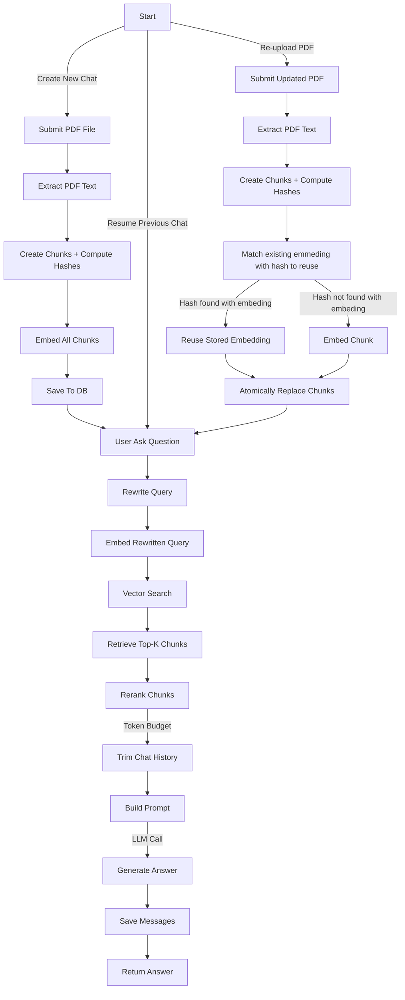

# AskMyPDF

AI-powered PDF chat application built with Django and LangChain. Upload any PDF and instantly start a conversation with it.

AskMyPDF uses a RAG (Retrieval-Augmented Generation) pipeline to extract, chunk, and embed your document into a vector database, then retrieves the most relevant context to answer your questions accurately — grounded strictly in the content of your PDF.


---

## Features

- Upload a PDF and process it in one step
- Chat with your PDF using natural language — messages stream into the UI without page reloads
- Interactive UI throughout — loading indicators on upload, animated "thinking" indicator while the AI responds, inline status for re-upload
- Resume previous chats — full conversation history preserved
- Re-upload an updated PDF to an existing chat — unchanged chunks are detected by content hash and reused, avoiding redundant embedding API calls
- Answers grounded strictly in PDF content, no hallucination
- Inline page citations — every answer cites the exact PDF pages it draws from, rendered as badges
- Markdown-formatted answers (bold, lists, code) rendered cleanly in the chat UI
- Query rewriting for accurate retrieval on follow-up questions
- Cross-encoder reranking to filter and reorder chunks by true relevance
- Token budget management to handle long conversations safely
- REST API layer — all mutations exposed as JSON endpoints under `/chats/api/`

---

## How it works

```
PDF Upload
  → extract text page by page              (pypdf)
  → split into overlapping chunks           (LangChain RecursiveCharacterTextSplitter)
  → compute SHA-256 hash per chunk
  → batch embed chunks                      (OpenAI text-embedding-3-small)
  → store chunks + vectors + hashes in DB   (pgvector)

PDF Re-upload (existing chat)
  → extract + split + hash new chunks
  → compare hashes against stored chunks
  → reuse stored embeddings for unchanged chunks (no API call)
  → embed only new/changed chunks           (OpenAI text-embedding-3-small)
  → atomically replace all chunks           (chat history preserved)

User Question
  → rewrite query using chat history        (resolves pronouns for better retrieval)
  → embed rewritten query
  → similarity search → top 5 chunks        (pgvector cosine distance)
  → rerank chunks by relevance              (cross-encoder, filters irrelevant chunks)
  → trim chat history to fit token budget   (oldest messages dropped first)
  → build prompt with context + history
  → generate answer with inline [Page N] citations   (gpt-4.1-mini)
  → save to chat history
  → render markdown + citation badges for display     (parser + template filter)
```

---

## Tech Stack

| Layer | Technology |
|---|---|
| Backend | Django, Django REST Framework |
| AI / LLM | LangChain, OpenAI (gpt-4.1-mini, text-embedding-3-small) |
| Reranker | sentence-transformers (cross-encoder/ms-marco-MiniLM-L-6-v2) |
| Vector Store | pgvector (PostgreSQL) |
| PDF Parsing | pypdf |
| Frontend | Django Templates, vanilla CSS |
| Package Manager | uv |

---

## Project Structure

```
ask-my-pdf/
├── config/                   # project settings
│   ├── settings.py
│   ├── urls.py
│   └── wsgi.py
├── chats/                    # main app
│   ├── models.py             # Chat, DocumentChunk, ChatMessage
│   ├── views.py              # template views (GET only — render pages)
│   ├── urls.py
│   ├── api/                  # DRF API layer
│   │   ├── __init__.py
│   │   ├── serializers.py    # ChatSerializer, ChatMessageSerializer, ChatCreateSerializer, etc.
│   │   ├── views.py          # ChatListCreateAPIView, MessageListCreateAPIView, ChatReuploadAPIView, ChunkListAPIView
│   │   └── urls.py           # all routes under /chats/api/
│   ├── services/
│   │   └── rag/
│   │       ├── __init__.py
│   │       ├── config.py           # model name, token limits, llm instance
│   │       ├── prompts.py          # query rewriter + answer generation prompts
│   │       ├── query_rewriter.py   # query rewriting for retrieval
│   │       ├── reranker.py         # cross-encoder reranking + filtering
│   │       ├── generate_response.py # prompt building + LLM call
│   │       ├── pipeline.py         # orchestrates the full ask() flow
│   │       ├── parser.py           # PDF text extraction + answer/citation rendering
│   │       ├── embedder.py         # chunking + embedding + retrieval
│   │       └── ingestor.py         # atomic DB save
│   ├── templatetags/
│   │   └── chat_extras.py      # render_answer filter (markdown + citation badges)
│   └── templates/
│       └── chats/
│           ├── base.html
│           ├── upload.html
│           └── chat.html
├── docker-compose.yml
├── .env
└── manage.py
```

---

## Getting Started

### Prerequisites

- Python 3.13+
- Docker (for PostgreSQL with pgvector)
- OpenAI API key

### 1. Clone the repository

```bash
git clone https://github.com/jishnusaha/ask-my-pdf
cd ask-my-pdf
```

### 2. Start PostgreSQL with pgvector

```bash
docker compose up -d
```

`docker-compose.yml`:

```yaml
services:
  db:
    image: pgvector/pgvector:pg16
    environment:
      POSTGRES_DB: ${POSTGRES_DB}
      POSTGRES_USER: ${POSTGRES_USER}
      POSTGRES_PASSWORD: ${POSTGRES_PASSWORD}
    ports:
      - ${POSTGRES_PORT}:5432
    volumes:
      - db_data:/var/lib/postgresql/data

volumes:
  db_data:
```

### 3. Install dependencies

```bash
uv sync
```

### 4. Configure environment

`.env`:

```env
OPENAI_API_KEY=sk-...
SECRET_KEY=+dg...
DEBUG=False
POSTGRES_DB=app
POSTGRES_USER=postgres
POSTGRES_PASSWORD=postgres
POSTGRES_HOST=localhost
POSTGRES_PORT=9002
ALLOWED_HOSTS=127.0.0.1
CSRF_TRUSTED_ORIGINS=http://127.0.0.1:9001
```

### 5. Run migrations

```bash
python manage.py migrate
```

### 6. Start the server

```bash
python manage.py runserver
```

> **Note:** On first run, the reranker model (~80MB) will be automatically downloaded from HuggingFace and cached locally at `~/.cache/huggingface/hub/`. Subsequent starts load from cache instantly.

Visit `http://localhost:9001/chats/`

---

## Data Models

```
Chat
  ├── title
  └── created_at

DocumentChunk
  ├── chat (FK)
  ├── content          ← raw text, source of truth
  ├── page_number
  ├── chunk_index
  ├── content_hash     ← SHA-256 of content, used for re-upload deduplication
  └── embedding        ← 1536-dim vector (pgvector)

ChatMessage
  ├── chat (FK)
  ├── role             ← "user" or "assistant"
  ├── content
  └── created_at
```

---

## RAG Pipeline

The pipeline is organized as a clean package under `chats/services/rag/`, each file with a single responsibility:

| File | Responsibility |
|---|---|
| `config.py` | Model name, token limits, rerank threshold, shared LLM instance |
| `prompts.py` | `ChatPromptTemplate` for query rewriting and answer generation |
| `query_rewriter.py` | Rewrites follow-up questions into standalone retrieval queries |
| `reranker.py` | Cross-encoder scoring, reordering, and filtering of retrieved chunks |
| `embedder.py` | Chunks (with SHA-256 hashing), embeds (skips pre-populated embeddings), and retrieves document chunks via pgvector |
| `generate_response.py` | Builds prompt with token-aware history trimming, calls LLM |
| `ingestor.py` | `ingest_chunks` atomically creates a new Chat + chunks; `reingest_chunks` replaces chunks on an existing Chat with embedding reuse |
| `parser.py` | Extracts text from PDF page by page (pypdf); renders answers (markdown + `[Page N]` citations) into safe HTML for display |
| `pipeline.py` | Orchestrates the full ask() flow |

### Query Rewriting

Follow-up questions like *"what did it say about the deadline?"* are rewritten into standalone queries like *"What are the project deadlines mentioned in the document?"* before retrieval. This resolves pronoun references and dramatically improves vector search accuracy. The rewritten query is used only for retrieval — the original question is preserved in the conversation.

### Reranking

After retrieval, a cross-encoder model (`cross-encoder/ms-marco-MiniLM-L-6-v2`) scores each `(query, chunk)` pair together — unlike the bi-encoder embedder which encodes them separately. This produces more accurate relevance scores. Chunks below the relevance threshold (`RERANK_THRESHOLD = 3`) are filtered out entirely. If all chunks are filtered, the top-ranked chunk is kept as a fallback. The model (~80MB) is loaded into memory once on Django startup and reused for all subsequent requests.

### Token Budget Guard

Before calling the LLM, the pipeline calculates the total token consumption across the system prompt, retrieved context, chat history, and current question. If the total exceeds the model's context window, the oldest chat history messages are dropped first until the prompt fits. Retrieved chunks are preserved as long as possible since they are the primary source of truth.

### Source Citations

Each retrieved chunk is injected into the prompt with a `[Page N]` marker, and the answer-generation prompt instructs the model to cite the source page inline (e.g. `Revenue grew 12% [Page 4].`) after any statement drawn from the context — only for pages that actually appear in the retrieved chunks, and never on a "not found" answer. The raw answer (markdown + `[Page N]`) is saved as-is in `ChatMessage.content`, then `parser.render_answer()` — exposed to templates via the `render_answer` filter — converts it to safe, escaped HTML, rendering the markdown and turning each `[Page N]` into a styled citation badge in the chat UI.

---

## Environment Variables

| Variable | Description |
|---|---|
| `OPENAI_API_KEY` | Your OpenAI API key |
| `POSTGRES_DB` | PostgreSQL database name |
| `POSTGRES_USER` | PostgreSQL username |
| `POSTGRES_PASSWORD` | PostgreSQL password |
| `POSTGRES_HOST` | PostgreSQL host (e.g. `localhost`) |
| `POSTGRES_PORT` | PostgreSQL port (e.g. `5432`) |
| `ALLOWED_HOSTS` | Comma-separated list of allowed hosts (e.g. `localhost,127.0.0.1`) |
| `CSRF_TRUSTED_ORIGINS` | Trusted origins for CSRF (e.g. `http://localhost:9001`) |


---

#  Application Flow



---


## API Endpoints

All mutation operations are exposed as a REST API under `/chats/api/`. The template views at `/chats/<pk>/` remain for page rendering; the frontend calls the API via `fetch()`.

| Method | URL | Description |
|---|---|---|
| `GET` | `/chats/api/` | List all chats |
| `POST` | `/chats/api/` | Upload a PDF and create a new chat |
| `GET` | `/chats/api/<pk>/messages/` | List all messages for a chat |
| `POST` | `/chats/api/<pk>/messages/` | Send a question — returns `[user, assistant]` messages |
| `POST` | `/chats/api/<pk>/reupload/` | Replace the PDF for an existing chat |
| `GET` | `/chats/api/<pk>/chunks/` | List stored chunks (paginated, `limit`/`offset`) |

---

## Future Improvement Plans

- [x] Source citation with page numbers
- [x] Re-upload updated PDF with content-hash deduplication
- [x] Interactive UI with REST API (no full-page reloads)
- [ ] Streaming responses
- [ ] Multi-PDF support per chat
- [ ] User authentication
- [ ] Export chat history